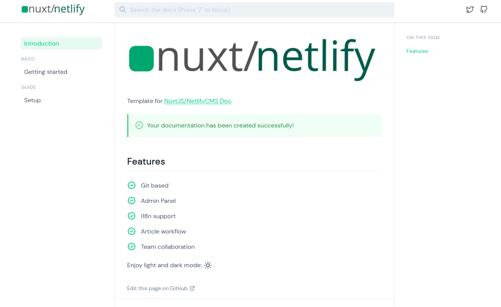
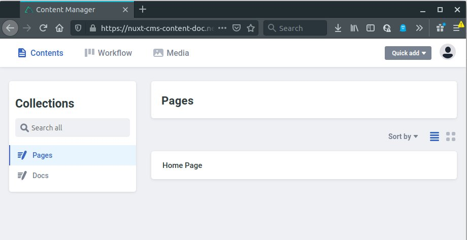

# @nuxt/netlify-cms-docs

[![npm version][npm-version-src]][npm-version-href]
[![npm downloads][npm-downloads-src]][npm-downloads-href]
[](https://hits.seeyoufarm.com)

> Create a documentation with @nuxt/netlify-cms-docs

- [📖 &nbsp;Read the @nuxt/content-theme-docs documentation](https://content.nuxtjs.org/themes/docs)

## Screenshot




## Usage

With [yarn](https://yarnpkg.com/en/):

```bash
yarn create nuxt-netlify-cms-docs <project-name>
```

Or with [npx](https://www.npmjs.com/package/npx) (`npx` is shipped by default since [npm](https://www.npmjs.com/get-npm) `5.2.0`)

```bash
npx create-nuxt-netlify-cms-docs <project-name>
```

Or starting with npm v6.1 you can do:

```bash
npm init nuxt-netlify-cms-docs <project-name>
```

## Adding to existing project

Use above command in the root of the project with `docs` as project name.

## References

1. [Create Nuxt Content doc](https://github.com/nuxt/content/blob/dev/packages/create-nuxt-netlify-cms-docs)

## License

[MIT License](LICENSE)

<!-- Badges -->
[npm-version-src]: https://img.shields.io/npm/v/create-nuxt-netlify-cms-docs/latest.svg
[npm-version-href]: https://npmjs.com/package/create-nuxt-netlify-cms-docs

[npm-downloads-src]: https://img.shields.io/npm/dt/create-nuxt-netlify-cms-docs.svg
[npm-downloads-href]: https://npmjs.com/package/create-nuxt-netlify-cms-docs
